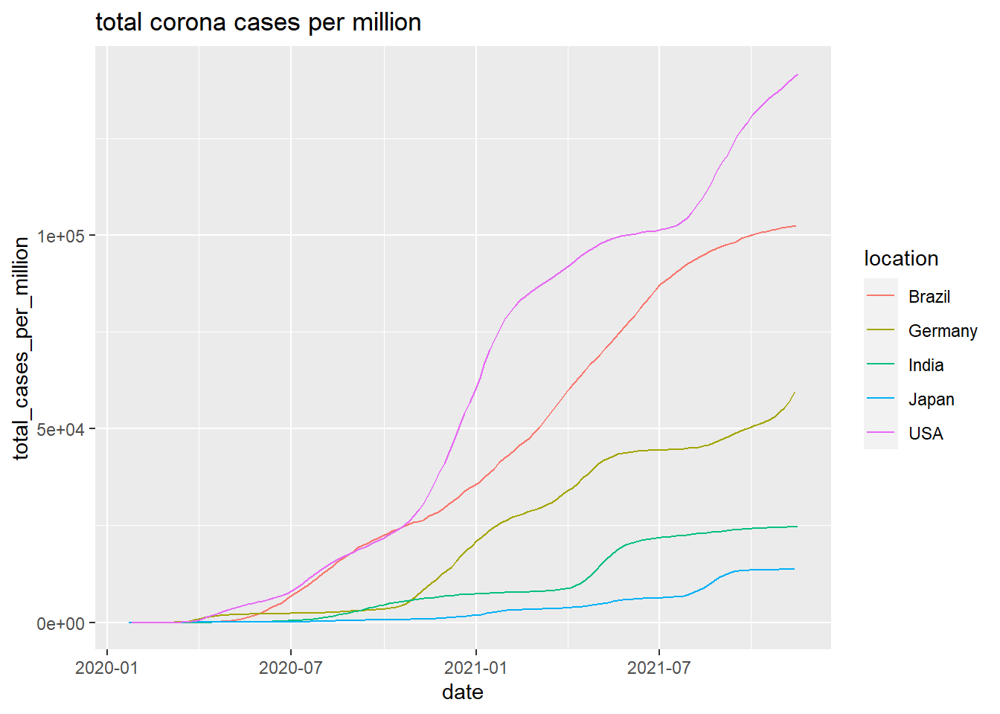

<h1 style="text-align: center;" align="center">Pandemic Industry Analysis</h1>

	CSCI 444 – Information Visualization: Fall 2021 

# Table of contents
* [Introduction](#introduction)
* [Data Sources](#data-sources)
	* [Cases](#cases)
	* [Retail](#retail)
	* [Flights](#flights)
	* [Naming Inconsistencies](#naming-inconsistencies)
* [Setup](#setup)
* [Usage](#usage)

## Introduction 

Do the corona vaccines help industries recover?
Corona has affected every country in the world and each of the
industries within them
* Vaccine helping?
* Total cases proportional to population in a country, along with a
  vaccine percentage and industry data
* Retail and recreation industry as well as the airline industry

	* assess the impact of the pandemic & vaccines on the airline industry by country
	* in R
	* Performed a statistical analysis in R on the impact of Covid in the transportation industry

## Data Sources 

### Cases 

OurWorldInData.org - collaboration between University of Oxford &
Global Change Data Lab

Data is updated daily from national
health services of the respective
countries & wrangled to uniformity

Working dates:
Feb. 1st, 2020 to
Oct. 31st, 2021

### Retail 

Taken from Our World in Data - Google Community Mobility Reports from Google Maps

Main figure used: percent change in visitors each day from February 2020 to October 2021

How did the virus affect the retail and recreation industry on a day to day basis?

restaurants, stores, malls, and other places of general
recreation
* Day-to-day basis shows how virus changed the everyday lives of
  people

United States, Germany, Japan, Brazil, Mexico, Nigeria,    
India, and Australia

Best represents the entire world
* Variety of economic rankings and geographical locations
* Each continent other than Antarctica
* Economic standings from top to bottom

### Flights 

hih

### Naming Inconsistencies 

Viet Nam -> Vietnam
USA -> United States
UK -> United Kingdom
Czechia -> Czech Republic
Congo -> Republic of Congo
Cote d'Ivoire -> Ivory Coast
Republic of Korea -> South Korea
Democratic Republic of Congo -> Democratic Republic of the Congo

## Setup 

After cloning the repository,

1. First, open a terminal in the root directory of the project.

2. Next, to install the necessary dependencies, use `pip install -r requirements.txt` in a python version 3.11 environment.

3. Then navigate to the source directory with `cd src`

4. Lastly run `python main.py vis` to start a visualization with the default parameters.

## Usage 

The command format is:

> `python main.py [action] [-environment_count] [-training_timesteps_k] [-place_count] [-vehicle_count] [-package_count] [-verbose] [-verbose_trigger]`

Training:
* For example, to train a model with 5 simultaneous environments for 2 million timesteps with an environment using 40 places, 12 vehicles, & 25 packages, the command would be `python main.py train 5 2000 40 12 25`

Testing/Visualization:
* To get a list of available models, use `ls models`
* The default model name format is "ppo_vrp_e`environment_count`-t`training_timesteps_k`_pvp-`place_count`-`vehicle_count`-`package_count`"
* To test a speicfic model, specify the parameters in the same way.
* For example, to test the model `ppo_vrp_e10-t100_pvp-80-10-20.zip`, simply run `python main.py test 10 100 80 10 20`