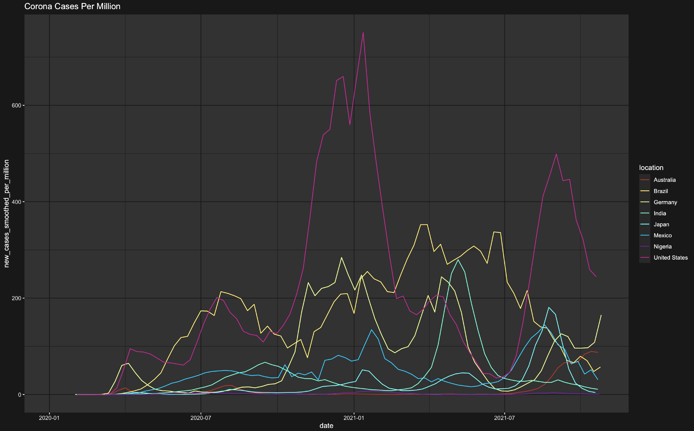
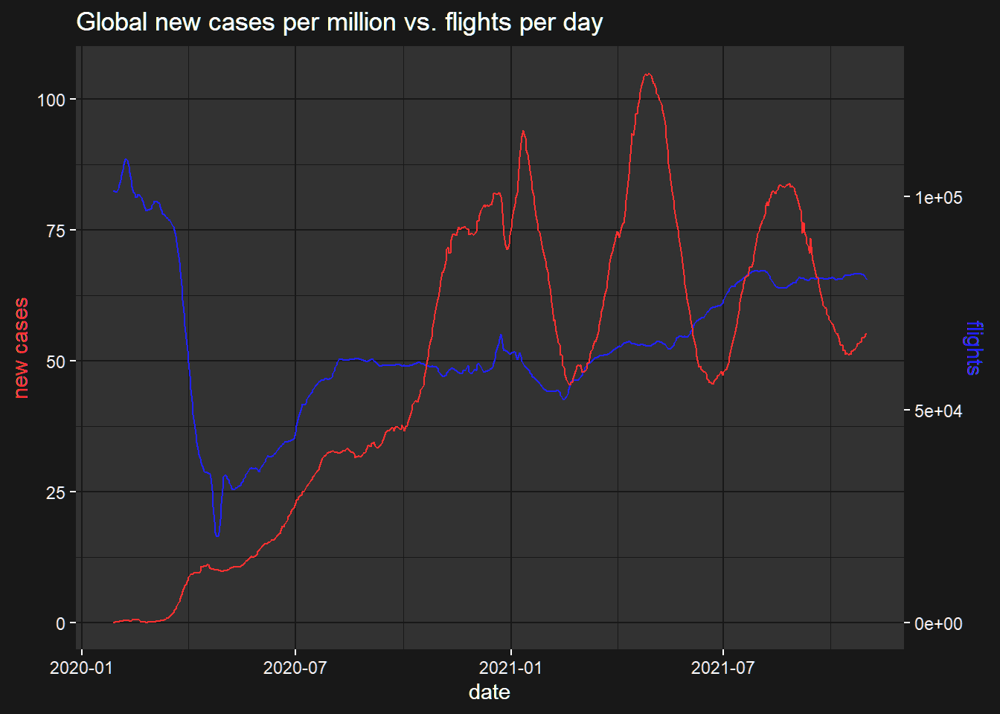
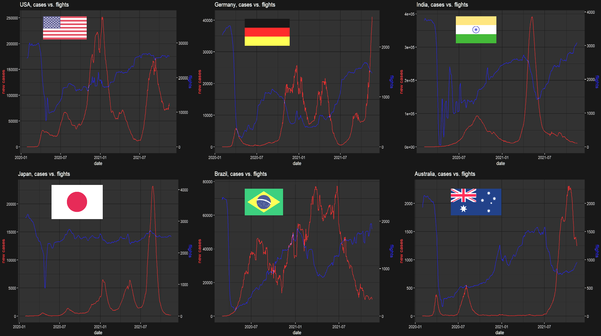

<h1 style="text-align: center;" align="center">Pandemic Industry Analysis</h1>

	CSCI 444 – Information Visualization: Fall 2021 

# Table of contents
* [Introduction](#introduction)
* [Data Sources](#data-sources)
	* [Cases](#cases)
	* [Retail](#retail)
	* [Flights](#flights)
	* [GDP PPP per capita](#gdp-ppp-pc)
	* [Naming Inconsistencies](#naming-inconsistencies)
* [Usage](#usage)

## Introduction 

Corona has affected every country in the world and each of the industries within them. This is an exploratory analysis notebook that attempts to answer the following question: Do the corona vaccines help industries recover?

Using various datasets, mainly the total cases proportional to the population & industry data, the impact of the pandemic & vaccines can be assessed in each industry.

## Data Sources 

### Cases 

The primary dataset used is in this project is the number of corona cases per million people. This comes from OurWorldInData.org - a collaboration between University of Oxford & Global Change Data Lab. Data is updated daily from national health services of the respective countries & wrangled to uniformity. In this project, the working dates are from *Feb. 1st, 2020 to Oct. 31st, 2021*. For average cases, a 4 day rolling average is used from the original data source. 

### Retail 

Also taken from Our World in Data, using Google community mobility reports from Google Maps, a general trend in retail & recreation can be analyzed through this dataset. This includes restaurants, stores, malls, & other places of general recreation. Primarily the percent change in visitors each day from February 2020 to October 2021 is used. For retail, the following countries were used to best represent the entire world with a variety of economic rankings & geographical locations: United States, Germany, Japan, Brazil, Mexico, Nigeria, India, & Australia.

### GDP PPP per capita 

Unfortunately, we did not specify the exact origin of this dataset, nor could I found anything online that matched these exact numbers. Since the dataset values resemble closely the real world values, replacing them with sourced information would not change much on the analysis.

### Flights 

Data about the number of flights was scraped from flightera.net, which is contained in `flights.csv`. Data is extracted from many public sources, but the main variable used is the total number of flights per day per country.

### Naming Inconsistencies 

An exciting part of this project is that some datasets only use the name of the country instead of the ISO, & the names between datasets are not consistent. Some examples are below:

* Viet Nam -> Vietnam
* USA -> United States
* UK -> United Kingdom
* Czechia -> Czech Republic
* Congo -> Republic of Congo
* Cote d'Ivoire -> Ivory Coast
* Republic of Korea -> South Korea
* Democratic Republic of Congo -> Democratic Republic of the Congo

## Usage 

To read the results itself, the analysis is in a presentable format as `report.html`. This was created using `report.qmd` using R 4.4.3