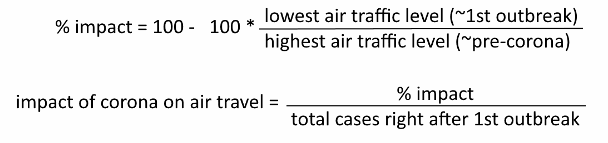
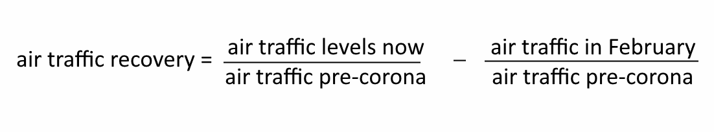

slide 14

```{r setup}
# contributions:
#     corona: Jake acquired the data set & wrote the paragraph text, Will wrote
#             wrangling & graph code. Since this was our story baseline, it was
#             revised a few times afterwards by both of us.
#     retail: Jake
#     flight: Will

pacman::p_load(lubridate, tidyverse, magrittr)

# rename things from covid to match `map_data("world")`
country_renamer <- \(column) {
	column %>%
		case_match(
			.,
			c('United States', 'United States of America (the)') ~ 'USA',
			c('United Kingdom', 'United Kingdom of Great Britain and Northern Ireland (the)') ~ 'UK',
			'Czechia' ~ 'Czech Republic',
			'Democratic Republic of Congo' ~ 'Democratic Republic of the Congo',
			'Congo' ~ 'Republic of Congo',
			c("Cote d'Ivoire", "Côte d'Ivoire") ~ 'Ivory Coast',
			'Russian Federation (the)' ~ 'Russia',
			'Korea (the Republic of)' ~ 'South Korea',
			'Bolivia (Plurinational State of)' ~ 'Bolivia',
			'Viet Nam' ~ 'Vietnam',
			'Central African Republic (the)' ~ 'Central African Republic',
			'Congo (the Democratic Republic of the)' ~ 'Democratic Republic of the Congo',
			'Congo (the)' ~ 'Republic of Congo',
			'Dominican Republic (the)' ~ 'Dominican Republic',
			'Gambia (the)' ~ 'Gambia',
			'Iran (Islamic Republic of)' ~ 'Iran',
			"Korea (the Democratic People's Republic of)" ~ 'North Korea',
			"Lao People's Democratic Republic (the)" ~ 'Laos',
			'Moldova (the Republic of)' ~ 'Moldova',
			'Philippines (the)' ~ 'Philippines',
			'Sudan (the)' ~ 'Sudan',
			'Taiwan (Province of China)' ~ 'Taiwan',
			'Tanzania, United Republic of' ~ 'Tanzania',
			'United Arab Emirates (the)' ~ 'United Arab Emirates',
			'Venezuela (Bolivarian Republic of)' ~ 'Venezuela',
			'Syrian Arab Republic' ~ 'Syria',
			'Niger (the)' ~ 'Niger',
			'Netherlands (the)' ~ 'Netherlands',
			.default=.
		)
}

#covid <- read_csv("https://covid.ourworldindata.org/data/owid-covid-data.csv")
covid <- read_csv('data/owid-covid-data.csv')

covid %<>%
	modify_at('date', as_date) %>%
	modify_at('location', country_renamer)
```

```{r, include=F}
# old system of renaming variables

# covid$location[covid$location == "United States"] <- "USA"
# covid$location[covid$location == "United Kingdom"] <- "UK"
# covid$location[covid$location == "Czechia"] <- "Czech Republic"
# covid$location[covid$location == "Democratic Republic of Congo"] <-
# 	"Democratic Republic of the Congo"
# covid$location[covid$location == "Congo"] <-
# 	"Republic of Congo"
# covid$location[covid$location == "Cote d'Ivoire"] <- "Ivory Coast"`

# for (name_pair in list(
# 	c('United States', 'USA'),
# 	c('United Kingdom', 'UK'),
# 	c('Czechia', 'Czech Republic'),
# 	c('Democratic Republic of Congo', 'Democratic Republic of the Congo'),
# 	c('Congo', 'Republic of Congo'),
# 	c("Cote d'Ivoire", 'Ivory Coast')
# )) {
# 	covid$location %<>% { .[. == name_pair[[1]]] <- name_pair[[2]] }
# }
```

## Corona

Corona has hit the entire world, but at drastically different levels. Some industries faced massive decline with no recovery in sight, while others have been virtually immune. The release of new vaccines has brought some hope to these industries, but how helpful are they really? We're going to do a comparison with a few key variables.

Although our dataset gives us many variables to start from, what seems to be closest to what we want is "total_cases_per_million", which by viewing from a few countries over time seems to only increase. This means we can use the latest total for each country as a rough number of how many cases they've had overall.

```{r initial graph}

covid %>%
	select('location', 'date', 'total_cases_per_million') %>%
	filter(location %in% c('USA', 'Germany', 'Japan', 'Brazil', 'India')) %>%
	group_by(location) %>%
	ggplot(mapping=aes(x=date, y=total_cases_per_million, color=location)) +
	geom_line() +
	labs(title='total corona cases per million')

# what is error????
# also lol send to em:
# To refer to column names that are stored as strings, use the `.data` pronoun
# was in filter()
# Learn more in ?rlang::args_data_masking
```

This means we can use the latest total for each country as a rough number of how many cases they've had overall. The dataset is updated regularly, but for the purposes of this project Oct. 31st 2021 is used as the most recent date. Filtering the data by this date can show how many total corona cases there are on a world map. In a way, this as a general metric of how heavy corona has hit a country.

```{r world_map_total_cases}

totals <- covid %>%
	select('location', 'date', 'total_cases_per_million') %>%
	filter(date %>% {
		month(.) == 10 & day(.) == 31 & year(.) == 2021
	})

map_data('world') %>%
	rename(location=region) %>%
	left_join(totals, by='location') %>%
	ggplot(mapping=aes(
		x=long,
		y=lat,
		group=group,
		fill=total_cases_per_million
	)) +
	geom_polygon(color='black') +
	coord_map(xlim=c(-180, 180), ylim=c(-60, 90)) +
	scale_fill_distiller(palette='Reds', trans='reverse') +
	labs(x=element_blank(), y=element_blank()) +
	guides(fill=guide_legend(
		title='Total cases per\nmillion as of\nOct. 31st, 2021'
	))
```

Next, the decline of 2 industries will be graphed. Although any industry can be measured in its own numerous ways, the important thing is that there is a number from before corona (normal) & after corona (impacted). The worst number can be used, the highest amount of decline, to measure how badly this industry was impacted. The dates of these minimums will also be in a scatter plot to see how useful the data is.

## 1. Retail

Retail & recreation includes restaurants, stores, malls, & other places of general recreation, such as movie theaters, bowling alleys, & sporting events. Retail & recreation was best measured on a day-to-day basis. Looking at this industry will give an important glimpse into the effects of COVID-19 and how it changed the everyday lives of people.

After creating the data frame from the retail and recreation statistics, 11 countries are selected to take a closer look. These countries, The United States, Germany, Japan, Brazil, India, & Australia are used to most closely represent the entire world. These countries were chosen because they span a variety of economic rankings and geographical locations. There are representatives from each continent other than Antarctica, and economic standings from the very top to the bottom of the world.

```{r select-countries, message=F}
retail <- read.csv('data/retail.csv')

retail %<>%
	modify_at('Entity', country_renamer) %>%
	modify_at('Day', ~as_date(ymd(.)))

selectedCountries <- c('USA', 'Germany', 'Japan', 'Brazil', 'India', 'Australia')

retail_filter <- retail %>%
	filter(Entity %in% selectedCountries) %>%
	select(c('Entity', 'Day', 'retail_and_recreation'))
```

The retail and recreation data frame consists of each individual day from February 17th, 2020. A separate column calculates the percent change in visitors on each of these days in a given country. The resulting graph, plotted with date on the x-axis and percent change on the y, shows how a countries retail and recreation industry has fluctuated over the last year plus.

```{r wrangle, message=F}
retail_filter %>%
	ggplot(mapping=aes(
		x=Day,
		y=retail_and_recreation,
		group=Entity,
		color=Entity
	)) +
	geom_line() +
	ggtitle("Retail and Recreation Day to Day") +
	theme(axis.title.y=element_blank(), axis.title.x=element_blank())

graph_year <- \(year_in) {
	retail_filter %>%
		filter(year(Day) == year_in) %>%
		group_by(month(Day)) %>%
		ggplot(mapping=aes(
			x=Day,
			y=retail_and_recreation,
			group=Entity,
			color=Entity
		)) +
		geom_line() +
		ggtitle(paste('Retail and Recreation by', year_in, 'months')) +
		theme(axis.title.y=element_blank(), axis.title.x=element_blank()) +
		facet_wrap(~month(Day), scales = 'free_x')
}

graph_year(2020)
graph_year(2021)


```

Overall, the first large dip in industry success around March 2020 is visible. This makes sense, as the 1st worldwide global shutdown due to the pandemic was in this month. People were staying home, & not giving the necessary business to their favorite stores & restaurants. This led to many businesses, especially smaller ones, closing. The Wall Street Journal says there was up to 200k extra business closures in the pandemic's 1st year alone. The pandemic destroyed the lives of many business owners, & this plot shows that beginning in March. Since then, the general trend of the industry has been positive, with some obvious fluctuation along the way. To show what part of this fluctuation resulted naturally & which part was the fault of COVID-19, graphed is the number of corona cases per million since last February. With general spikes between December 2020 & January 2021, March & April 2021, & as recently as August & September 2021, the ups & downs of COVID cases ca be seen. To discover how these numbers affected the retail & recreation industry, & eventually if the vaccine helped, a further look into 3 countries is helpful; The States, Brazil, & India. The choice of these 3 countries was driven by GDP per capita - GDP divided by the number of residents of a country. Purchasing power parity is GDP per capita that also taking into account inflation rates and the cost of local goods and services to get a more accurate picture of a nation's average standard of living. By looking at a country's average living standards, a good idea of how much the everyday person can afford to partake in retail & recreation activities can be understood.

```{r kable-extra, message=F}
pacman::p_load(kableExtra)
ppp <- read_csv('data/ppp.csv')

ppp %>%
	kbl(caption='Purchasing Power Parity Around the World', booktabs=T) %>%
	kable_styling(bootstrap_options='striped') %>%
	column_spec(1, color='black') %>%
	column_spec(2, color='green') %>%
	column_spec(3, color='black') %>%
	row_spec(0, color='black')
```

Shown in the table are the PPP's of the 11 countries listed above. After choosing the United States, who comes in at 6th at 63,416, Brazil, 85th at 14,916, & India, 128th at 6,461, included is a top 10 country, a middle of the road country, & a relatively poor country. While many Middle Eastern & African countries have lower GDPs per capita, they simply do not have well documented vaccination statistics for a successful study. Still, with these 3 countries, how corona numbers affected industries with varying economic statuses can be seen.

After individually graphing each country's industry percentages, corona cases & vaccine rates, one can find how corona really affected each countries retail & recreation.

```{r graph-us, message=F}

graph_retail <- \(country_name) {
	retail_filter_country <- retail_filter %>%
		filter(Entity == country_name) %>%
		pivot_wider(names_from=Entity, values_from=retail_and_recreation)

	p1 <- retail_filter_country %>%
		ggplot(mapping=aes(
			x=Day,
			y=.data[[country_name]],
			fill=Day
		)) +
		geom_bar(stat='identity') +
		ggtitle(paste(country_name, 'Retail & Recreation by Day')) +
		theme(
			axis.title.y=element_blank(),
			axis.title.x=element_blank(),
			legend.position='none'
		) +
		scale_fill_viridis_c(option='magma')
	print(p1)

	covid_filter <- covid %>%
		filter(location == country_name) %>%
		select(
			'location', 'date',
			'new_cases_smoothed_per_million',
			'people_fully_vaccinated_per_hundred'
		) %>%
		group_by(location) %>%
		replace(is.na(.), 0)
		# it is assumed that a missing value simply means nothing was reported

	p2 <- covid_filter %>%
		ggplot(mapping=aes(x=date, y=new_cases_smoothed_per_million, color=location)) +
		geom_line() +
		labs(title=paste(country_name, 'Corona Cases Per Million'))
	print(p2)

	p3 <- covid_filter %>%
		ggplot(mapping=aes(x=date, y=people_fully_vaccinated_per_hundred)) +
		geom_line(mapping=aes(color=location)) +
		labs(title=paste(country_name, 'Vaccination Percentage'))
	print(p3)
}

graph_retail('USA')

```

Now it can be seen that there is an almost direct correlation between rising corona cases & falling industry success. At the beginning of the global shutdown in March, the percentage of visitors on a daily basis plummets near negative 50%. At the same time, corona cases in the United States begin to rise. The point where the correlation really sticks out is around October 2020. Just before this time, the retail & recreation industry was slowly beginning to rise towards an average amount of visitors. Then, in October, a huge peak in corona cases appears. Right after this outbreak, the industry begins to crash again, all the way back down near negative 30%. Once this peak starts to fall, the industry slowly starts to recover again. This definitely shows a relation between corona cases & the success of the retail industry in the United States - the more cases there are the more stores & restaurants get shut down, the more people stay home, & the more the industry suffers. Also visible is the possible effects of the vaccine in the plots. Around September 2021, there is another outbreak of corona cases in the US with a peak nearing the one of October 2020. However, the retail & recreation industry does not struggle & collapse like before. A possible reason? The increase in percent of people in the US with the vaccine. More people with the vaccine means less people are scared to leave their home, even amid a case outbreak. Alongside this, places of retail, including big events like concerts and sporting events, were more likely to stay open with vaccination numbers rising. Some places and events even required vaccination to enter, but regardless it is clear they were far more likely to stay open with vaccine numbers rising.

```{r graph-brazil, message=F}

graph_retail('Brazil')
```

Looking at Brazil, a country with far less GDP per capita, a very similar story appears. Around March 2020, the industry crashes the same time that the first global lock down occurs & corona cases rise across the country. One difference between Brazil & the United States is that the lowest dip mostly hangs around the high 30s opposed to the high 40s in the US. But, similarly to the US, as the original high point of cases begins to slope downwards, the industry starts to recover, rising back near a 15 percent drop. Then, the peak of corona cases hits Brazil between March & April 2021. When this happens, the industry crashes again as expected, even though not as badly. The interesting section of Brazil's data is how rapidly the cases slope downwards come July 2021. Around this time, the vaccine number rises, which is the cause of the drop of cases. With the vaccine helping cases drop, Brazilians began to hit stores, restaurants, & public events again, proven by how the percentage of visitors rises back near their original average.

```{r graph-india, message=F}
graph_retail('India')
```

India brought a whole different story to the table. When March came around, the country's cases stayed relatively low. The reason for this is shown by the industry's visitor percentage. Around this time, the retail & recreation industry dropped below a negative 80% loss of customers - double that of the United States and Brazil. This shows how serious the original lock down was in India, as the industry nearly disappeared completely. After the industry started to reopen and approach its original point, a corona outbreak, India's largest by far, occurred in May 2021. After this, the country appeared to go into full lock down again, with the industry dropping below negative 60 percent visitor loss. Once India's vaccine levels started to really rise in July, the peak dropped off and the industry started to recover.

Overall, we can see similarities and differences in the ways that a high, middle, & low GDP per capita country were affected by covid. The United States had an easier time recovering the retail and recreation industry, while only dealing with two corona peaks. Brazil had more ups and down in their corona cases, but the vaccine seemed to help them out more than the US. On the poor end, it seems countries are far more likely to go into a strict lockdown like India did, nearly erasing their retail & recreation industry. This helped them deal with only one large corona outbreak, which appears to have been significantly helped by the release of the vaccine.

Corona affected both rich and poor countries, high and low population countries, and countries in varying geographic areas. It did not care what was in its path, and one of the things it destroyed across the world was the retail & recreation industry. The vaccine has aided in the return of this industry, attempting to open up places of business return their owners to where they belong.

## 2. Airlines

Airline travel basically came to a halt. For this project's purposes, simply using the total number of flights a country has had is sufficient. Let's 1st graph the entire world in terms of cases & flights.

```{r setupFlights, message=F}
flights <- read_csv('data/flights.csv') # 'flights.r' creates this csv

flights %<>%
	rename(flight_count = flightCount) %>%
	mutate_at('location', country_renamer) %>%
	mutate_at(c('flight_count', 'num'), as.numeric) %>%
	mutate_at('date', ~as_date(ymd(.)))

flights_global <- flights %>%
	select(c(date, flight_count)) %>%
	group_by(date) %>%
	filter(date <= '2021-10-31') %>%
	summarize(flights=sum(flight_count))

global_stats <- covid %>%
	filter(location == "World") %>%
	select(date, new_cases_smoothed_per_million) %>%
	na.omit() %>%
	inner_join(flights_global, by = "date")


pacman::p_load(scales)

# generic function to graph a line graph comparing 2 different y axes
graph2axes <- \(
	input, x,
	y1, y1name=y1, y1color='red',
	y2, y2name=y2, y2color='blue',
	title=paste(y1name,'vs.',y2name)
) {
	print(
		ggplot(input, aes(x=.data[[x]])) +
			geom_line(aes(y=.data[[y1]]), color=y1color) +
			geom_line(aes(y=rescale(
				.data[[y2]],
				.data[[y1]] %>% { c(min(.), max(.)) }
			)), color=y2color) +
			scale_y_continuous(
				name=y1name,
				sec.axis=sec_axis(~rescale(
					., # can also be .x
					input[[y2]] %>% { c(min(.), max(.)) }
				), name=y2name)) +
			theme(
				axis.title.y=element_text(color=y1color),
				axis.title.y.right=element_text(color=y2color)) +
			labs(title=title, x=x)
	)
}

graph2axes(
	input=global_stats,
	x='date',
	y1='new_cases_smoothed_per_million',
	y1name='new cases per million',
	y2='flights',
)
```

It doesn't seem to line up too well. There is 1 significant drop from March to July 2020, with only the 2nd & 3rd case surges hindering growth. However, flights were shut down as soon as corona started, & the industry has been very careful about opening back up, as the business is very risky. Also, things could be very different depending on the country. Let's look at a few specific countries to see what the data really tells.

```{r flightspercapita, message=F}
population <- read_csv('data/WPP2019_TotalPopulationBySex.csv') %>%
	filter(Time == 2020) %>% # now
	select(LocID, Location, PopTotal) %>%
	unique() %>% # collapse other values
	mutate(PopTotal = PopTotal * 1000) %>% # population is in 1000s
	rename(num = LocID, location = Location, pop = PopTotal)
flights_pop <- inner_join(flights, population, by='num') %>%
	select(-location.y) %>%
	rename(location = location.x)

focus <-  c('USA', 'Germany', 'Japan', 'Brazil', 'India', 'Australia')

flights_pop %>%
	filter(location %in% focus) %>%
	group_by(location) %>%
	ggplot(mapping=aes(
		x=date,
		y=flight_count / pop,
		color = location
	)) +
	geom_line() +
	labs(title='# of flights per capita')
```

The flights between countries of similar flight counts per capita also seems to vary. So to get a better story, a closer look at some individual countries is needed.

```{r flightspercountry}
for (country in focus) {
	flightsTemp <- flights %>%
		filter(location == country) %>%
		select(date, flight_count)
	casesTemp <- covid %>%
		filter(location == country) %>%
		select(date, new_cases_smoothed) %>%
		na.omit()

	graph2axes(
		input=inner_join(flightsTemp, casesTemp, by='date'),
		x='date',
		y1='new_cases_smoothed',
		y1name='new cases',
		y2='flight_count',
		y2name='flights',
		title=paste('new cases vs. flights in', country)
	)

}; rm(country, flightsTemp, casesTemp)
```

It is still a bit difficult to read, however, we can see that the initial outbreak caused a massive dip in every country, with each successive peak hindering recovery. Is there a way to compare how much a country's airline industry was affected compared to another? Taking the pre-corona levels & the lowest point in that country's air traffic, then comparing it to the amount of total cases a country had by the end of the previously mentioned initial air traffic drop: July 2020. The formula would be



Although the number by itself doesn't really mean anything, it can be used to compare every country on a map. Before that however, let's make sure that these minimums & maximums are not too spread out time-wise, otherwise this statistic could be weakly founded.

```{r impactdates, message=F}

# extract the dates of when a country had the most & the least flights
flights_impact <- flights %>%
	group_by(location) %>% {
		bind_rows(
			slice_min(., flight_count, n=1, with_ties=F),
			slice_max(., flight_count, n=1, with_ties=F)
		)
	} %>%
	mutate(type=if_else(flight_count == min(flight_count), 'min', 'max'))

flights_impact %>%
	ggplot(aes(x=date, fill=type)) +
	geom_histogram(binwidth=4, alpha=.5, position='identity') +
	scale_fill_manual(values=c('Red', 'Blue'))
```

There seems to be quite a few outliers much later than expected, but this is because some countries such as Russia have had their airline industries recover already. However, the rest of the dates bunch up all around the start, so our data is good here. To make sure the correct mins & maxes caused by the 1st wave of corona are used, let's filter everything before July 2020 to calculate impact levels & map it.

```{r flightimpactmap, message=F}

# same as before, except filter by date & calculate impact
flights_impact <- flights %>%
	filter(date < as.Date('2020-07-01')) %>%
	group_by(location) %>% {
	bind_rows(
		slice_min(., flight_count, n=1, with_ties=F),
		slice_max(., flight_count, n=1, with_ties=F)
	)
} %>%
	mutate(type=if_else(flight_count == min(flight_count), 'min', 'max')) %>%
	mutate(impact = 100 - (100 * min(flight_count) / max(flight_count)))

# flight_impact <- setNames(data.frame(matrix(ncol = 8, nrow = 0)),
# 	c("num", "iso", "location", "minFlights", "minDate", "maxFlights",
# 	  "maxDate", "impact"))
# for (country in everyCountry) {
# 	tempFlights <- flights %>%
# 		filter(location == country & date < as.Date("2020-07-01")) %>%
# 		select(num, iso, location, date, flightCount)
# 	max <- tempFlights[tempFlights$flightCount == max(tempFlights$flightCount),]
# 	min <- tempFlights[tempFlights$flightCount == min(tempFlights$flightCount),]
#
# 	flight_impact <- rbind(flight_impact, data.frame(
# 		num = tempFlights$num[1],
# 		iso = tempFlights$iso[1],
# 		location = country,
# 		minFlights = min$flightCount[1],
# 		minDate = min$date[1],
# 		maxFlights = max$flightCount[1],
# 		maxDate = max$date[1],
# 		impact = 100 - (100 * min$flightCount[1] / max$flightCount[1])
# 	))
# }

map_data('world') %>%
	rename(location=region) %>%
	left_join(flights_impact, by='location', relationship='many-to-many') %>%
	ggplot(mapping=aes(
		x=long,
		y=lat,
		group=group,
		fill=impact
	)) +
	geom_polygon(color='black') +
	coord_map(xlim=c(-180, 180), ylim=c(-60, 90)) +
	scale_fill_distiller(palette='Reds', trans='reverse') +
	labs(x=element_blank(), y=element_blank()) +
	guides(fill=guide_legend(title='% drop in air traffic from corona'))
```

Ah North Korea, invincible as always. Other than that, no country is visibly below maybe 60%. So it's safe to say that corona has affected most countries air traffic pretty heavily. Now let's see if the vaccines are helping.

```{r globalvaxxvsflights, message=F}
vaxx_global <- covid %>%
	filter(location == 'World') %>%
	select(date, people_fully_vaccinated_per_hundred) %>%
	na.omit()

graph2axes(
	input=inner_join(flights_global, vaxx_global, by='date'),
	x='date',
	y1='people_fully_vaccinated_per_hundred',
	y1name='% vaccinated',
	y1color='darkgreen',
	y2='flights'
)

```

Is it working? Well maybe a little at the start. There is a massive spike in vaccines which seems to be completely ignored by the airline industry. Again, it might be better to look at other countries.

```{r vaxxpercountry, message=F}
for (country in focus) {
	flightsTemp <- flights %>%
		filter(location == country) %>%
		select(date, flight_count)

	vaxxTemp <- covid %>%
		filter(location == country) %>%
		select(date, people_fully_vaccinated_per_hundred) %>%
		na.omit()

	graph2axes(
		input=inner_join(flightsTemp, vaxxTemp, by='date'),
		x='date',
		y1='people_fully_vaccinated_per_hundred',
		y1name='% vaccinated',
		y1color='darkgreen',
		y2='flight_count',
		y2name='flights',
		title=paste('vaccination rate vs. flights in', country)
	)

}; rm(country, flightsTemp, vaxxTemp)
```

It does seem to help, except somehow Australia seems to decrease in flights. In spite of this based on these graphs, it is reasonably effective for the other countries. It is time-consuming to look at the graph of every single country in the world, so let's try yielding a single number that shows the correlation between airline recovery & vaccine rate increases. The recovery of the airline industry can be derived in the following



The vaccine growth rate from March can also be simply used to further get a number to compare to. Mapping these correlations shows how effective they are across the world.

```{r vaxflightcorrelation, message=F}
date_range <- c('2021-02-01', '2021-10-31') %>% as.Date()

flights_temp <- flights %>%
	select(num, location, date, flight_count) %>%
	group_by(location) %>%
	filter(between(date, date_range[1], date_range[2]))
	#modify_at('flight_count', ~.x/max(.x))

covid_temp <- covid %>%
	select(iso_code, location, date, people_fully_vaccinated_per_hundred) %>%
	group_by(location) %>%
	filter(between(date, date_range[1], date_range[2])) %>%
	#modify_at('people_fully_vaccinated_per_hundred', ~.x/max(.x)) %>%
	replace(is.na(.), 0)

cor_safe <- \(x, y, ...) {
	if (sd(x, na.rm=T) == 0 || sd(y, na.rm=T) == 0) {
		return(0)
	} else {
		cor(x, y, ...)
	}
}

correlations <- inner_join(covid_temp, flights_temp, by=c('date', 'location')) %>%
	group_by(location) %>%
	mutate(flight_vax_corr = cor_safe(flight_count, people_fully_vaccinated_per_hundred)) %>%
	select(iso_code, location, flight_vax_corr) %>%
	unique()


map_data('world') %>%
	rename(location=region) %>%
	left_join(correlations, by='location', relationship='many-to-many') %>%
	ggplot(mapping=aes(
		x=long, y=lat, group=group,
		fill=flight_vax_corr
	)) +
	geom_polygon(color='black') +
	coord_map(xlim = c(-180, 180), ylim=c(-60, 90)) +
	scale_fill_distiller(
		palette = 'Spectral',
		direction = 1,
		limits=c(-1, 1),
		breaks=seq(-1, 1, by=.25)
	) +
	labs(x=element_blank(), y=element_blank()) +
	guides(fill=guide_legend(title='correlation')) +
	ggtitle('Flight recovery rates vs. Vaccination rates, Feb. - Oct. 2021')
```

Vaccines seem to be much more effective in North America & Europe. This seems probable as these countries have a much better chance at higher vaccination rates & therefore higher airline recovery rates. Japan & South Korea have modest numbers compared to the rest of the 1st world. This is likely because they're industry recovery happened sooner than the vaccination. Australia & New Zealand have negative correlation, which is due to their recent international travel caps set by the governments. It canbe reasonably concluded that in developed countries with good vaccination rates excluding the aforementioned exceptions, the vaccine seems to improve the recovery of these industries. Below is the same graph, but with the ability to view the numbers of specific countries.

```{r interactive}
pacman::p_load(plotly)
correlations %>%
	plot_ly(
		type='choropleth',
		locations=.$iso_code,
		z=.$flight_vax_corr,
		text=.$location,
		colorscale='agsunset',
		reversescale=T
	)
```
